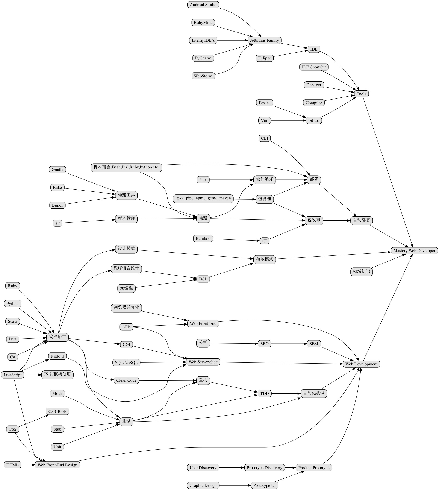

#Awesome Web Developer路线图

> Phodal's 阅读书单

``注意``:以下内容主要以个人的经验(开发 + 阅读的书目) + ThoughtWorks(Martin Flower所在公司)的软件交付(外包)经验为主导。适用于大、中小企业的Web开发，流程上可能不尽相同,但是大致适用。

##持续交付

> 传统软件交付(一次交付)与Web，乃至现在的软件交付很大的一个不同点在于——持续交付。

当我们昨天、今天打开淘宝的时候，可能已经是不同两个版本的软件，而我们并没有察觉出来。而这个软件可能是前天、上星期写好的，如果是上上个月写好的，那么就说明阿里的软件发布模式是有问题的。

这依赖于自动化测试、版本管理、自动部署等等，领域知识或者领域模式已经是经过市场充分验证了。

而在我们开发阶段要做的就是测试(TDD)、修复bug、交付功能等等。

而在部署以后则是性能等等。

###《持续交付:发布可靠软件的系统方法》

在这本书里面介绍了如何构建一座大桥——书的封面。作为一本Jolt大奖的作品，里面详细的说明

 - 如何持续的交付软件
 - 如何发布可靠软件的系统方法

书中可以详细了解如何交付一个软件: 

从频繁提交代码、自动化测试(保证测试覆盖) -> 运行本地测试 -> 服务器运行测试 -> 部署到测试环境 -> 交付管理

而这些都应该是自动的，所以你需要知道的东西有: 如何编写测试(Junit、Qunit、BDD、TDD..)、自动化测试(Selenium..)、版本管理(git)、配置(feature toggle)、依赖管理、部署脚本等等。

(ps:上面括号里面的不在书的范围内。)

##Web
###《实用负载均衡技术:网站性能优化攻略》

>

##JavaScript

###《EffectiveJavaScript:编写高质量JavaScript代码的68个有效方法

>

###《JavaScript语言精粹(修订版)》

##Agile
路线图:

##Android

##Cookbook
	
《Android开发秘籍(第2版)》
《Android平板电脑开发秘籍》
《PythonCookbook(第3版)(影印版)》